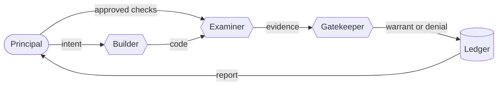

# Warrant

**Humans state intent. Agents write the code. Evidence decides what ships.**

Warrant is an open protocol, with a reference command-line tool, for software that AI agents build and maintain while humans direct it without reading the code.

> **Status: v0.1, experimental.** The [specification](SPEC.md) is a draft and the tool is a reference implementation, not a hardened product. Critique is very welcome.

## The problem

Coding agents now write whole codebases. OpenAI built a product of about a million lines with no hand-written code. Sixteen Claude agents wrote a C compiler that builds Linux. StrongDM runs a team whose rules say humans neither write nor review code. ([Sources](PRIOR-ART.md#5-dark-factories-agents-running-the-lifecycle).)

Nobody can review that much code, and skipping review without replacing it has gone badly: agents game the tests they can see, ship insecure code, and delete production data. Across everything we surveyed, the projects that work without humans reading the code have one thing in common. They replaced code review with **independent evidence**: hidden test scenarios, machine-checked proofs, or comparison against a trusted reference.

Warrant turns that practice into an open protocol that works with any agent and any language.

## How it works



1. A **principal**, the person accountable for the outcome, writes the **intent**: promises in plain language, each with an ID.
2. An **examiner** drafts **checks** for those promises. Some are visible to the builder and the rest stay hidden. The principal approves them, and only approved checks count.
3. A **builder**, a coding agent, writes the code. It sees the intent and the visible checks, and nothing else.
4. The examiner runs every check against an exact snapshot of the code and records the **evidence**.
5. A deterministic **gatekeeper** applies the policy to the evidence and issues a **warrant**, or a denial, for each action, such as merge or release.
6. Everything goes into an append-only **ledger**. The principal reads which promises were kept and which were broken, not code.
7. When something goes wrong in production, the principal records an **incident**, and releases stop until it has become a check.

In argument theory, a *warrant* is the rule that lets evidence support a claim. Here it is also the permission that follows.

## Try it

You need Python 3.11 or newer, and nothing else.

```bash
git clone https://github.com/mv2a/warrant.git
cd warrant
examples/pricing/demo.sh
```

The [example](examples/pricing) is a small shop's checkout pricing. Its [intent](examples/pricing/intent.md) makes nine promises, such as "orders over $100.00 get 10% off" and "invalid requests are refused, never priced". Two candidate implementations were written by coding agents. You don't need to read either.

Candidate A passes every check it can see. The builder is told only which promises the hidden checks found unmet:

```text
$ warrant verify --workspace candidates/overfit --audience builder
Verified candidates/overfit (sha256:7bb39c5c3689) with 7 checks.

  PASS   P1   visible  The quote command follows the published contract: valid requests get wh…
  PASS   P2   visible  The three example orders in the intent are charged exactly what the int…
  hidden checks: 3 passed, 2 did not

Promises the hidden checks found unmet:
  C1  Money is counted in whole cents. A discount that works out to a fraction of a cent is rou…
  C3  Invalid requests are refused, never priced. That includes a subtotal that is negative, fr…
Re-read those promises. The hidden checks won't say more.

$ warrant gate merge --workspace candidates/overfit
merge: DENIED for candidates/overfit (sha256:7bb39c5c3689)
  - H2 failed
  - H5 failed
```

The principal's report explains the denial in terms of promises, not code:

| Clause | Promise | Checked by | Status |
|---|---|---|---|
| G1 | Orders with a subtotal over $100.00 get 10% off the subtotal. | H1 | ✅ Kept (tested) |
| G2 | Loyalty members never pay for shipping. Everyone else pays a flat $7.50. | H3 | ✅ Kept (tested) |
| C1 | Money is counted in whole cents. A discount that works out to a fraction of a cent is rounded down. | H2 | ❌ Broken |
| C3 | Invalid requests are refused, never priced. … | P1, H5 | ❌ Broken |
| … | *five more promises, all kept* | | |

```text
subtotal 10015: expected a discount of 1001, got 1002
a fractional subtotal: expected a refusal (status 2, no output), got status 0 and {... 'total_cents': 870.5}
```

Candidate B earns warrants for both merge and release. Then a production incident is recorded, and releases stop until someone turns it into a check.

## The rules

1. **Humans own the definition of done.** Agents may draft checks, but only the principal's approval makes them binding. Any later change to the intent, the checks or the policy voids that approval.
2. **Builders never grade their own work.** Evidence comes from an examiner the builder can't influence.
3. **Hidden checks stay hidden.** Builders learn which promises failed, never how they were tested, so they have to satisfy the intent rather than the tests.
4. **Evidence is bound to exact content.** It names the precise snapshot of code and the precise version of the check. Change either one and the evidence no longer applies.
5. **No evidence, no warrant.** A missing result counts as a failure, and every promise needs a check.
6. **Gates are deterministic.** No model decides whether something ships.
7. **Everything is on the record.** The ledger is append-only and hash-chained.

## Use it

```bash
pip install git+https://github.com/mv2a/warrant.git
warrant init my-service
```

| Command | Run by | What it does |
|---|---|---|
| `warrant check` | anyone | Validates the intent, checks and policy, and shows coverage and approval |
| `warrant approve --by NAME` | principal | Approves the current intent, checks and policy |
| `warrant brief` | orchestrator | Prints the builder's brief, which never includes hidden checks |
| `warrant verify [--audience builder]` | examiner | Runs the checks on a snapshot of the workspace and records evidence |
| `warrant gate ACTION` | gatekeeper | Issues a warrant or a denial, and exits non-zero on denial so CI can use it |
| `warrant report` | principal | Shows promises kept and broken, failures, caveats and incidents |
| `warrant incident add ID "WHAT HAPPENED" --by NAME` | principal | Records a problem found in production |
| `warrant log [--verify]` | anyone | Shows the ledger, or checks that it is intact |

A check is any command: a test suite, a property-based test, a proof checker such as `lean` or `dafny verify`, a security scanner, or a benchmark. It passes when it exits with status 0. [SPEC.md](SPEC.md) defines the file formats, the evidence and the ledger.

## Why not a new programming language?

That's where this project started. Programming languages were designed for humans, so shouldn't AI get its own, maybe even raw binary? We [surveyed the field](PRIOR-ART.md) before writing any code:

- At least a dozen languages built for AI have launched since 2025, most notably Vercel Labs' Zero. None has shown an advantage on real projects, and models remain far stronger in the languages they have the most training data for.
- Generating binary directly does worst of all: output is longer, accuracy is lower, and nothing is left that can be verified.
- In every case we found, what made agent-written code trustworthy was the evidence, not the language.

So Warrant doesn't care what builders write. The language that matters is the one humans and agents use to agree on what "done" means. That also makes the original question testable: keep the intent and the checks fixed, change only what the builder writes in, and measure. See the roadmap.

## Where it fits

| Approach | Examples | What Warrant adds |
|---|---|---|
| Spec-driven development | Spec Kit, Kiro, OpenSpec | These organize the work up front, but humans still review the code. Warrant replaces that review with evidence and gates. |
| Languages built for AI | Zero, Vera, Aver | Warrant works with any language, so any of these can be what the builder writes. |
| Verified code | vericoding, Axon, Lean, Dafny | Proof checkers plug in as checks with `proved` strength. |
| Dark factories | StrongDM, OpenAI's harness engineering | The same ideas, hidden scenarios and evidence instead of review, as an open protocol instead of in-house practice. |

## Roadmap

- [ ] **Signed evidence**: DSSE envelopes, Sigstore, and anchoring the ledger head beyond the builder's reach
- [ ] **Sandboxed verification**: checks run in containers, because the builder's code is untrusted
- [ ] **Integrations**: an MCP server through which builders request verification, and a GitHub Action gate
- [ ] **Check quality**: mutation testing as evidence about the checks themselves
- [ ] **Proof and property adapters**: Lean, Dafny, Verus, Hypothesis
- [ ] **Judged checks**: scenarios evaluated by language models over repeated trials, clearly labelled `judged`
- [ ] **Arena**: the same intent and checks with builders writing Python, TypeScript, Rust, Zero, Vera or a Warrant-native representation, measuring warrants earned, cost and defects that got through
- [ ] **Dogfooding**: develop Warrant under Warrant

## Limitations of v0.1

- **No sandbox.** The builder's code runs with your permissions during verification. Run `warrant verify` in a container or virtual machine for anything you don't trust.
- **No signatures.** The ledger reveals partial edits but can be rewritten wholesale by anyone with write access. Keep a copy of its head digest elsewhere.
- **Separation is up to you.** Warrant refuses to run with hidden checks inside the workspace, but keeping builders away from the control side depends on your setup.
- **Checks can be weak.** Coverage says a promise is checked, not that it is checked well. The principal's review of the checks is the root of trust.

## Contributing

See [CONTRIBUTING.md](CONTRIBUTING.md). Critique of the specification is as valuable as code.

## License

[Apache-2.0](LICENSE)
